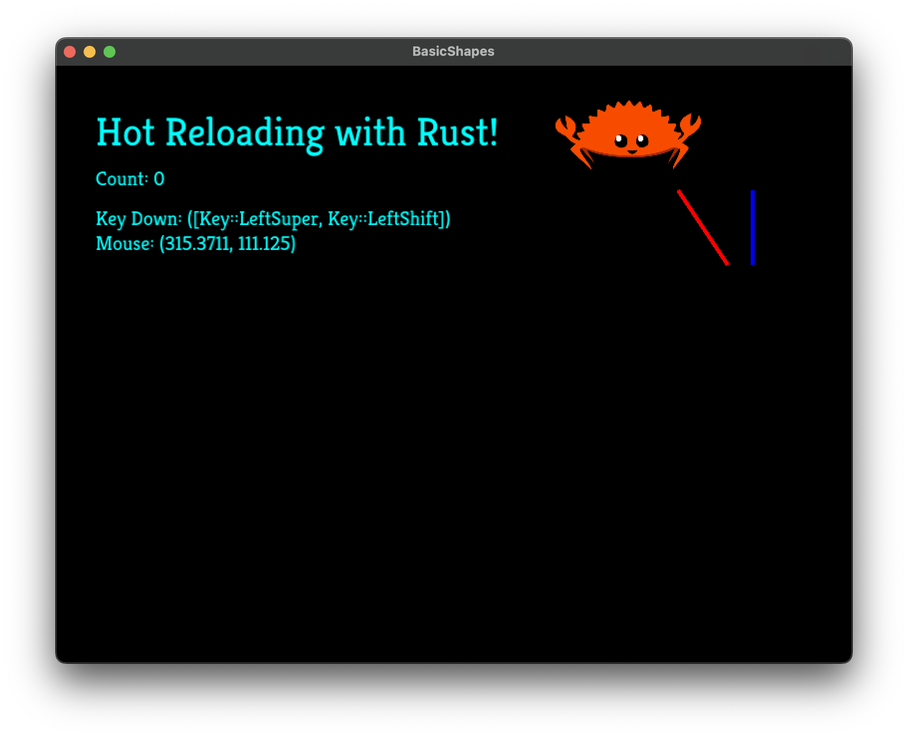

# Game Hotreload Example

This repository is an example project using the power of [Web Assembly](https://developer.mozilla.org/en-US/docs/WebAssembly) and the [WebAssembly Component Model](https://component-model.bytecodealliance.org/) to create a hot reloadable game development experience.

## Screenshot

## Getting Started

0. `rustup target add wasm32-wasip1 && cargo install wasm-tools`
1. Install [Just](https://github.com/casey/just)
2. In one terminal window run `just watch` to start compiling the game assembly on every change
3. In another terminal window, run `just hotreload`
4. Make a change in `game/src/lib.rs` to some text or a color, save the file, and watch the logic
5. Click to increment the counter, and hotreload with another change to see that the state survives
5. Run `just run` to run the project without wasmtime or hotreloading

## How does it work?

The project is split up into two crates:

- Game (A simple library) - Contains all of the core logic describing the scene to be drawn, how to interact with keyboard/mouse, etc. 
- Launcher (A macroquad game binary) - A uncommonly changed shell which forwards UX interactions and draws to the screen as requested

The launcher contains a feature flag `hotreload` which changes how the launcher consumers the game crate:

Without `hotreload` the `Launcher` has a direct hard library dependency on `Game` and nothing special happens.

With `hotreload` however the Launcher loads up a web assembly packaged version of the launcher crate via wasmtime. A simple file watcher then waits for the assembly file to change, and then reloads it before processing the next frame. Before this reload, the entire state of the game is serialized via Serde which is then restored inside the new web assembly instance.

## How does the host launcher communicate with the game?

There is a WebAssembly Component Interface file (`wit/interface.wit`) which contains a simple stateless interface to a portion of macroquad. Each frame is passed the state of the mouse and keyboard and calls draw instructions on an imported screen resources. These instructions are then executed within the launcher host.

As we want to arbitrarily reload the game, the global state of the graphics stack and window must not be lost. This is why the Game does not directly use macroquad.

## Why not just use hot-lib-reloader-rs

[hot-lib-reloader-rs](https://github.com/rksm/hot-lib-reloader-rs) is an impressive crate, but in my experience was never stable enough to actually save me much time. About 1 in 5 times my projects would crazy, so I had to setup a relaunch script, which would occasionally go haywire and need to be manually killed.

Any use of any thread local storage, or function pointers (dyn traits) would caused it to misbehave. This applied significant design pressure to how the project needed to be laid out to be "binary reload friendly".

So far WASM hot reloading has been completely stable in my experience.

## Areas for improvement

### Unnecessary Dependency

The launcher binary uses a feature flag to enable hot reload goodness. Unfortunately it is not possible to remove a dependency, so there is an "unnecessary" hard link from game to launcher even in the hotreload case. The launcher is written to never use the game dependency in hotreload contexts, but if it did those portions would not be hotreloaded (or you would get a compile error).

It is possible to use two inverse feature flags (hotreload and direct), but that is discouraged behavior. I have not looked into this much yet. In the past the crate hierarchy was more complex and feature unification prevented from being an option.

### WIT interface interactions with VSCode

As the WIT interface used between the worlds is code generated, it is not always trivial to see the final rust interface, as you can not jump to definition. The `rust-analyzer: Expand macro recursively at caret` feature can be useful, but it is not an ideal user experience.
